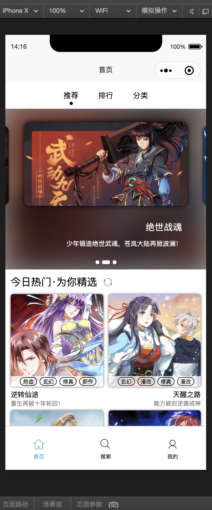
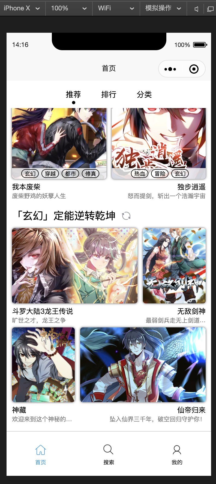
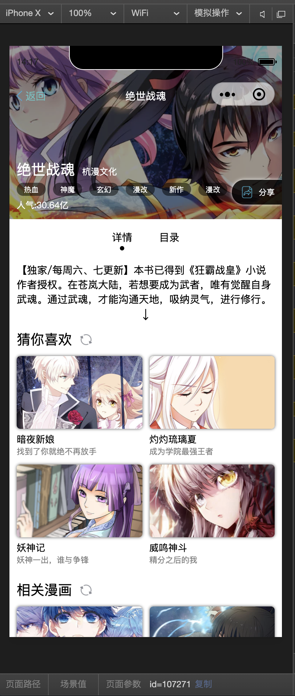
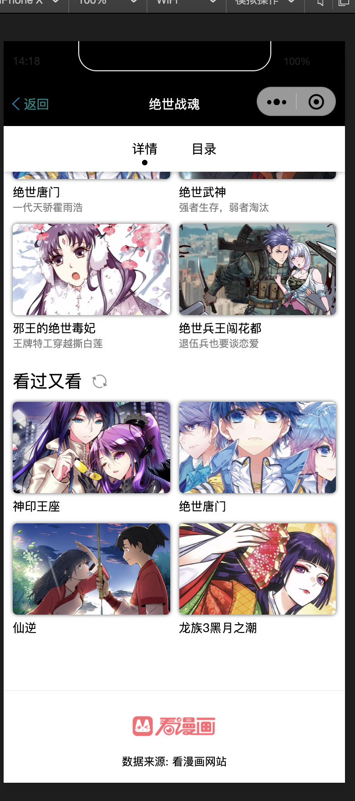
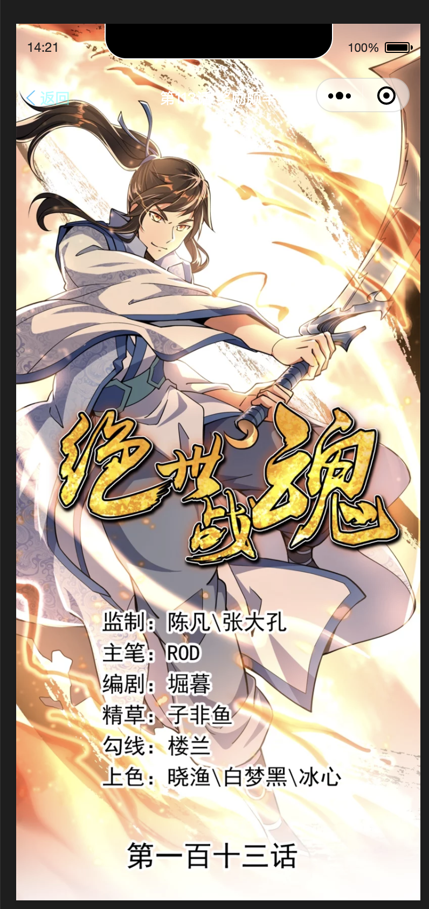
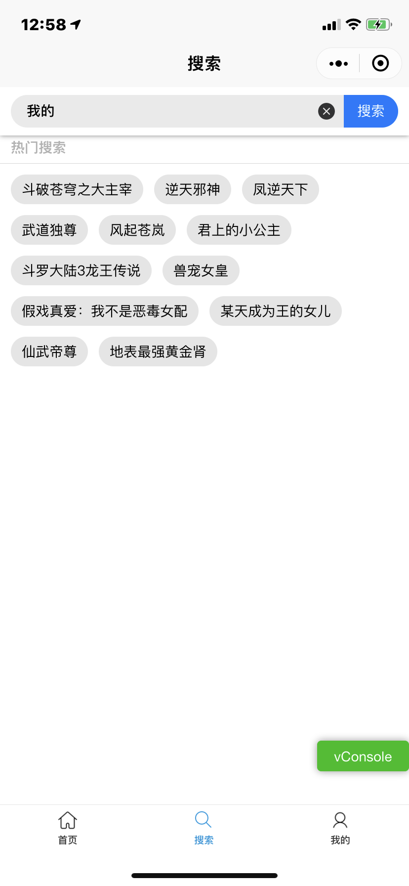
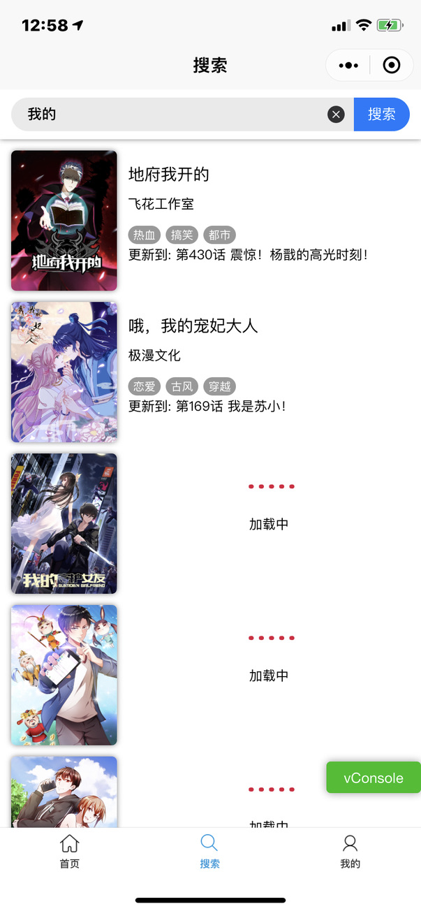
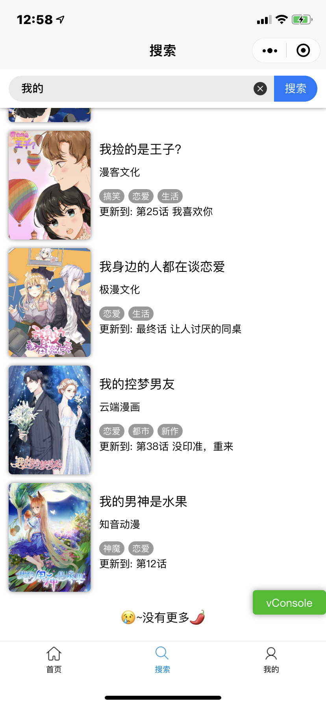

##  看漫画小程序-第三方版

##### Author:QiuChenly

##### ATTATION:**本小程序仅用作学习研究,所使用的接口与数据版权全部归"KanManHua"或"看漫画"公司所有.**

## 技术

- uni-app
- 微信小程序

## 代码共享协议

- 代码使用GPL V3 Licence授权.
- 任何人可以复制使用本源码.
- 不允许以各种理由利用本源码进行各种形式的收费与限制.
- 禁止使用本源码对"看漫画"公司的利益造成破坏,
- 使用本源码进行二次开发需要公开全部项目源码.
- 原作者(QiuChenly)不承担任何第三方二次开发编译人员所带来的法律责任与刑事责任.
- 不接受以上条款?那就给爷爬远一点.

## 项目截图

