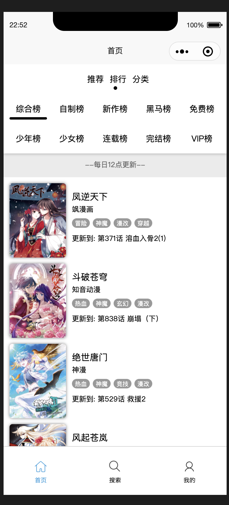
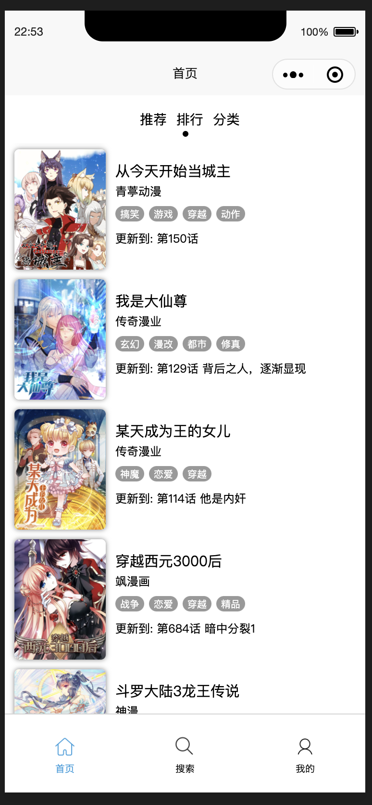
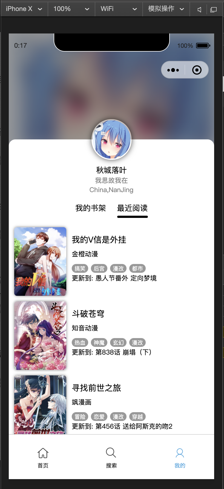
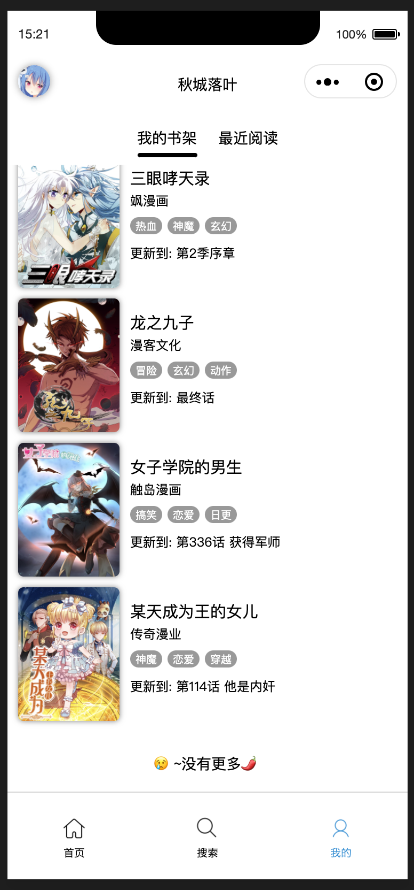

##  看漫画小程序-第三方版

##### 开发人员:QiuChenly(963084062@qq.com)

##### ATTATION:**本小程序仅用作学习研究,所使用的接口与数据版权全部归"KanManHua"或"看漫画"公司所有.**

##### 本项目有大部分技术均为炫技用,比如用户页的CSS特效/列表滑动过渡效果等,仅为满足本人强迫症,无实际用途.

## 技术

- uni-app
- 微信小程序

## 代码共享协议

- 代码使用GPL V3 Licence授权.
- 任何人可以复制使用本源码.
- 不允许以各种理由利用本源码进行各种形式的收费与限制.
- 禁止使用本源码对"看漫画"公司的利益造成破坏,
- 使用本源码进行二次开发需要公开全部项目源码.
- 原作者(QiuChenly)不承担任何二次开发人员所带来的法律责任与刑事责任.
- 不接受以上条款?那就给爷爬远一点.

## 项目进度

| 小程序模块          |  状态  | 开发耗时 | 代码评分(百分制) | 备注                                          |
| :------------------ | :----: | :------: | :--------------: | :-------------------------------------------- |
| 主页 - 推荐         | 已完成 |   两天   |        90        | 主页代码实现过于单调,完全没有性能优化.        |
| 主页 - 排行         | 已完成 |    半天     |        100        | 研究了一下滑动过渡算法,做出了满意的菜单过渡.                                             |
| 主页 - 分类         | 未开始 |    -     |        -         | -                                             |
| 搜索 - 热门         | 已完成 |   半天   |        95        | 实现代码全部依赖原生CSS3,手段单一.            |
| 搜索 - 搜索历史     | 未开始 |    -     |        -         | -                                             |
| 搜索 - 搜索结果     | 已完成 |   一天   |        89        | 嵌套了过多的组件与API,没有性能优化.           |
| 搜索 - 加载下一页   | 已完成 |   半天   |       100        | 太简单了没什么好评价的.                       |
| 搜索 - 顶部搜索框   | 已完成 |   半天   |        95        | 利用占位实现清除内容按钮,实际用户体验一般.    |
| 详情 - 详情页       | 已完成 |   半天   |        80        | 使用伪扩张高度实现点击显示全部,体验一般.      |
| 详情 - 目录页       | 已完成 |   半天   |        90        | 布局简陋.                                     |
| 详情 - 相关推荐     | 已完成 |   半天   |        90        | UI简陋.                                       |
| 详情 - 分享         | 已完成 |    半天     |        90        | 只是简单地做了下阅读页面的三个小点分享                                             |
| 阅读 - 当前章节     | 已完成 |   半天   |        85        | 用户体验一般.                                 |
| 阅读 - 底部功能菜单 | 未开始 |    -     |        -         | -                                             |
| 阅读 - 上一话下一话 | 已完成 |    半天     |        99        | 仔细设计了按钮位置与过渡效果                                             |
| 我的 - 整体布局     | 已完成 |   半天   |        95        | 页面排版简单.                                 |
| 我的 - 我的书架     | 已完成 |   半天   |        95        | 复用了相同的组件                                             |
| 我的 - 最近阅读     | 已完成 |   半天   |        90        | 复用组件,快速实现相关功能                                             |
| 我的 - 性别设置 | 已完成 | 半天 | 100 | 直接用自带控件实现了性别切换. |
| 登录 - 微信授权     | 未开始 |    -     |        -         | -                                             |
| 本地存储 - Vuex     | 进行中 |   半天   |        98        | 利用实时Store进行数据即时共享,新数据共享手段. |
| 本地存储 - Storage  | 进行中 |   半天   |       100        | 深度优化了本地存储内容,精简大量数据(10MB限制  |
| 性能优化 | 进行中 | 半天 | 100 | - |
| 性能优化 - 排行页面 | 已完成 | 半天 | 100 | 自研懒加载页面技术,懒载入技术,官方未提供接口. |

- 懒加载技术
  - 一次只加载十条数据.滑动到指定页面才会开始加载此页面的数据,而非十个页面同时加载,优化低配置机器性能.

## 代码如何运行?

1.下载uniapp官方IDE:Hbuilder X,另外还需要下载微信开发者工具.

2.安装完成HBuilder X与微信开发者工具后,从HBuilder X项目开始菜单中打开本源码所在文件夹.

3.HBuilder X运行,选择"运行到微信小程序模拟器"中.

4.从微信开发者工具中 预览 真机自动预览.

5.微信开发者工具需要用微信登录后使用.

6.手机上微信中需要打开调试小程序才可以获取到数据,具体路径为:右上角三个点点击,选择弹出菜单中的"打开调试",重启小程序即可食用.

## 计划开源小程序组件

| 组件名   | 作用                                                 | 状态              |
| -------- | ---------------------------------------------------- | ----------------- |
| qBanner  | 首页推荐顶部的大Banner栏.                            | 已封装为单个组件. |
| qTab     | 首页顶部与我的页面中部的tab栏,自带点与横线样式.      | 已封装为单个组件. |
| qHotTag  | 热门搜索的单个关键词控件,单个显示,多个显示需要v-for. | 已封装为单个组件. |
| qBar     | 漫画详情页的头部自定义控件Bar,开放滚动监听进度接口.  | 已封装为单个组件. |
| qLoading | 纯CSS3实现加载过程中等待的动画.五根竖线会上下跳动.   | 已封装为单个组件. |

## Credits

| 致谢下方企业或组织提供的相关数据          | 用途                                          |
| ----------------------------------------- | --------------------------------------------- |
| KanManHua/看漫画 - 成都二次元动漫有限公司 | 小程序所使用的服务器数据接口与图片数据源提供. |
| iconfont - 阿里巴巴开发者图标资源库       | 小程序所使用的部分图标.                       |
| MacQQ - 腾讯公司                          | 小程序用到了部分MacQQ中的图标资源.            |
| uni-app - DCloud公司                      | 小程序所用到的主要技术来源.                   |
| Vue - Vue开源组织                         | 小程序所使用的主要技术来源.                   |

## 项目截图

